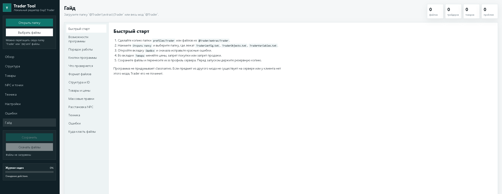
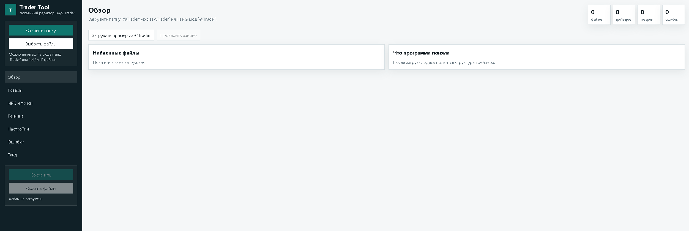
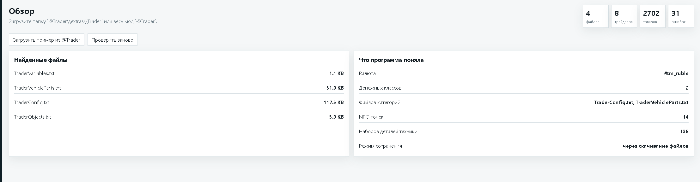

<div align="center">

# DayZ Trader Local Tool

### Local DayZ Trader config editor and validator

[Русский](README.md) · **English**

[](LICENSE)
[]()
[]()
[]()
[](../../releases)
[]()

A local toolbox for DayZ server owners and modders.
Load an `@Trader` folder, inspect Trader configs, find mistakes, edit prices,
fix Trader IDs, check NPC/object positions, split vehicle configs, and manage VehicleParts.

Runs locally in your browser. No cloud, no account, no installation.

</div>


## 📸 Screenshots

<div align="center">

<br><br>

<br><br>

</div>

---

## Highlights

<table>
<tr>
<td width="33%" valign="top">

### Local first
Your configs stay on your PC.
The tool does not upload Trader files anywhere and does not require internet.

</td>
<td width="33%" valign="top">

### Trader-aware
Understands `TraderConfig`, `<OpenFile>`, `TraderObjects`,
`TraderVariables`, `VehicleParts`, Trader IDs and map positions.

</td>
<td width="33%" valign="top">

### Fix workflow
Shows issues, task progress, operation logs
and safe fixes with visible results.

</td>
</tr>
</table>

---

## Quick Start

```text
1. Download the repository or release archive.
2. Run start_trader_tool.bat.
3. Opened URL:
   http://127.0.0.1:8765/index.html
4. Click "Open folder".
5. Select @Trader\extras\Trader or the whole @Trader mod folder.
6. Check the Issues tab.
7. Fix problems and save/download the generated files.
```

> Important: always keep backups before replacing files on a live server. The tool validates structure and common Trader mistakes, but the final test must still be done in-game and through the server RPT log.

---

## Tabs & Features

| Tab | What it does |
|---|---|
| Overview | Summary of files, traders, categories, items and issues |
| Structure | `Trader ID -> categories -> items`, category moves, ID sorting |
| Items | Item table, buy/sell prices, buy/sell availability |
| NPC & Positions | `TraderObjects.txt`, marker, object position, safezone, vehicle spawn |
| Vehicles | `TraderVehicleParts.txt`, missing parts, unused parts |
| Variables | `TraderVariables.txt` with parameter hints |
| Issues | Errors, warnings, safe fixes, validation report |
| Guide | Built-in guide for Trader format and tool usage |
| Task Log | Operation progress: what is running, done, and still pending |

---

## What It Can Fix

<details open>
<summary><b>TraderConfig and OpenFile chain</b></summary>

<br>

- Parses the main `TraderConfig.txt`.
- Reads linked files through `<OpenFile>`.
- Finds loaded files that are not linked.
- Adds missing `<OpenFile>` links for vehicle configs.
- Checks `<FileEnd>`.
- Can create `TraderConfig_Vehicles.txt` and move vehicle categories into it.

</details>

<details open>
<summary><b>Items, categories and prices</b></summary>

<br>

- Finds broken item lines.
- Shows empty or suspicious classnames.
- Checks buy and sell prices.
- Finds resale exploits.
- Removes duplicated items inside one category.
- Applies bulk price edits to the current filter.
- Enables or disables buying/selling with `-1`.

</details>

<details>
<summary><b>Trader IDs and structure</b></summary>

<br>

- Displays traders by ID.
- Checks duplicate IDs and gaps.
- Sorts traders in ascending order.
- Keeps `TraderObjects.txt` references in sync when moving categories.
- Checks whether every Trader ID has a map marker/object.

</details>

<details>
<summary><b>NPC, vending objects and positions</b></summary>

<br>

- Checks `TraderMarkerPosition`.
- Checks `ObjectPosition`.
- Finds incomplete trader points.
- Finds markers without traders and traders without markers.
- Checks `Safezone`.
- Checks `TradingDistance`.
- Warns when objects are too close and may steal interaction focus.

</details>

<details>
<summary><b>Vehicles and VehicleParts</b></summary>

<br>

- Finds vehicles inside the main `TraderConfig.txt`.
- Offers to move cars, helicopters and boats into a separate vehicle config.
- Checks `VehicleSpawn` for vehicle traders.
- Finds sold vehicles without `<VehicleParts>`.
- Creates missing VehicleParts blocks.
- Finds VehicleParts blocks for vehicles that are not sold.
- Lets you remove the extra block or mark it as intentional.

</details>

---

## Supported Files

| File | Purpose |
|---|---|
| `TraderConfig.txt` | Main categories and item config |
| `TraderConfig_Vehicles.txt` | Separate vehicle config |
| `TraderConfig_Boats.txt` | Separate boat config |
| `TraderObjects.txt` | NPCs, vending objects, positions, safezone, vehicle spawn |
| `TraderVariables.txt` | Trader timers, distances and behavior |
| `TraderVehicleParts.txt` | Vehicle parts installed after purchase |
| `TraderVehicleParts_Boats.txt` | Boat parts |
| `TraderAdmins.txt` | Trader admin settings |
| `trader_types.xml` | Extra Trader type data |

---

## License

[MIT](LICENSE)
